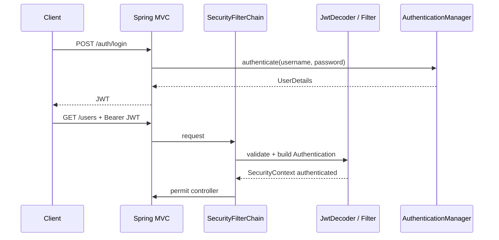

# Spring Security in QuiLAI — AI briefing document

**Audience:** Another AI or engineer auditing this codebase for implementation issues and improvements.  
**Scope:** Everything related to authentication, authorization, JWT, and HTTP security as of the analyzed tree.  
**Stack:** Spring Boot **3.5.0**, Java **17**, Spring Security, JJWT **0.12.6**, Spring OAuth2 Resource Server (Nimbus `JwtDecoder`), JPA + PostgreSQL (local/docker), H2 on classpath.

---

## 1. Executive summary (what actually works today)

| Capability | Status |
|------------|--------|
| Password hashing on register | **Yes** — `BCryptPasswordEncoder` in `AuthService.register` |
| Username/password login via `AuthenticationManager` | **Yes** — `AuthService.login` |
| Issuing a signed JWT after login | **Yes** — `JwtUtil.generateAccessToken` (HS256, custom claims) |
| Validating JWT on subsequent API calls | **No** — `SecurityFilterChain` does **not** register OAuth2 Resource Server or a custom JWT filter |
| Populating `SecurityContext` from `Authorization: Bearer …` | **No** — protected routes require `authenticated()` but nothing establishes authentication from the token |
| Using the configured `JwtDecoder` + `JwtAuthenticationConverter` | **No** — beans exist but are **not** attached to `HttpSecurity` |
| CORS | **Yes** — fixed origin `http://localhost:3000` |
| CSRF | **Disabled** globally |
| Role/authority model in JWT | **Partially** — roles are embedded in JWT claim `roles`; converter is never applied |

**Implication:** After login, the client receives a JWT string, but **calling `/users` or any non-`/auth/**` endpoint with that token will not authenticate the request** unless some other mechanism exists outside this configuration (it does not in the reviewed code).

---

## 2. Module map (where to look)

| Path | Role |
|------|------|
| `redrock.rhino.quilai.config.SecurityConfig` | `SecurityFilterChain`, CORS, CSRF, `authorizeHttpRequests`, password & auth manager beans, **duplicate `SecretKey` bean** |
| `redrock.rhino.quilai.security.JwtConfig` | Second `SecretKey` bean, `NimbusJwtDecoder`, `JwtAuthenticationConverter` (roles claim) |
| `redrock.rhino.quilai.security.JwtUtil` | Create JWT with JJWT (HS256) |
| `redrock.rhino.quilai.security.CustomUserDetailsService` | Load user by username for `DaoAuthenticationProvider` |
| `redrock.rhino.quilai.service.AuthService` | Register + login orchestration |
| `redrock.rhino.quilai.controller.AuthController` | `/auth/register`, `/auth/login` |
| `redrock.rhino.quilai.controller.UserController` | `/users` (intended protected) |
| `redrock.rhino.quilai.model.User` | JPA entity + `UserDetails` (authorities from `UserRole` enum) |
| `redrock.rhino.quilai.exception.GlobalExceptionHandler` | `BadCredentialsException`, validation, generic errors |

---

## 3. Dependencies (Maven) — security-relevant

From `pom.xml`:

- `spring-boot-starter-security`
- `spring-boot-starter-oauth2-resource-server` — used only for **`JwtDecoder` / OAuth2 JWT types** in `JwtConfig`, not full OAuth2 login flows in this app
- `spring-boot-starter-oauth2-client` and `spring-boot-starter-oauth2-authorization-server` — **present; no corresponding configuration** in the reviewed Java code (dead weight / future use / accidental)
- `jjwt-api` + `jjwt-impl` (runtime) — signing tokens in `JwtUtil`
- `spring-boot-starter-actuator` — **not explicitly configured** in `SecurityConfig`; verify exposure in production

---

## 4. Configuration properties

### `application.properties`

- `security.jwt.secret=${JWT_SECRET}` — secret must be present at runtime (often via `.env` through `spring.config.import=optional:file:.env[.properties]`).
- `security.jwt.expiration=100000` — **100 000 ms ≈ 100 seconds** (short-lived access token; confirm intent).
- `security.jwt.issuer=ndea` — written into JWT and used by `JwtUtil`; `NimbusJwtDecoder` can validate issuer if configured (currently not used in filter chain).

### Profiles

- `application-local.properties`: Postgres URL, `ddl-auto=create`, Docker Compose file reference.
- `application-docker.properties`: service hostnames for Postgres/Ollama.

**Operational note:** If `JWT_SECRET` is missing or too short, startup or signing may fail or be weak. HS256 expects a sufficiently long key (JJWT/Nimbus typically require key strength in line with algorithm).

---

## 5. Security filter chain (authoritative behavior)

`SecurityConfig.securityFilterChain` effectively does:

1. Enable CORS with `corsConfigurationSource()`.
2. **Disable CSRF** for all endpoints.
3. Authorize:
   - `/auth/**` → `permitAll`
   - **everything else** → `authenticated`
4. **No** `httpBasic()`, **no** `formLogin()`, **no** `oauth2ResourceServer()`, **no** custom `OncePerRequestFilter` for JWT.

There is **no** session-based login configured either. So “authenticated” for non-`/auth` routes is only achievable if something else establishes the `SecurityContext` (not observed here).

### CORS

- `allowedOrigins`: single origin `http://localhost:3000`
- `allowCredentials(true)` with explicit origin (correct pattern; avoid `*` with credentials)
- Methods include `GET`, `POST`, `PUT`, `DELETE`, `OPTIONS`, `PATCH`
- `allowedHeaders: *`

For staging/production, origins should be externalized (properties/env), not hardcoded.

---

## 6. Authentication for login (username/password)

### Flow

1. `POST /auth/login` with `LoginRequestDTO` (`username`, `password`).
2. `AuthService.login` builds `UsernamePasswordAuthenticationToken` and calls `AuthenticationManager.authenticate(...)`.
3. On success, principal is `UserDetails`; authorities are collected as strings (e.g. `USER`, `ADMIN` from enum names).
4. `JwtUtil.generateAccessToken(username, Map.of("roles", roles))` returns a **raw JWT string** in the response body (`ResponseEntity.ok(String)`).

### Providers

- `SecurityConfig` declares a `DaoAuthenticationProvider` bean wired to `CustomUserDetailsService` + `PasswordEncoder`.
- Spring Boot’s `AuthenticationConfiguration` generally aggregates `AuthenticationProvider` beans into the `AuthenticationManager` (behavior depends on exact Boot version; treat as **intended** design).

### User loading

- `CustomUserDetailsService` loads `redrock.rhino.quilai.model.User` from `UserRepository.findByUsername`.
- It builds `org.springframework.security.core.userdetails.User` with **encoded password** from DB and `u.getAuthorities()`.

### Password on register

- `AuthService.register` encodes password with `PasswordEncoder` before save.

---

## 7. JWT creation (`JwtUtil`)

- Library: JJWT 0.12.x
- Algorithm: **HS256** via `signWith(secretKey, SignatureAlgorithm.HS256)`
- Claims:
  - `sub` → username
  - `iss` → `security.jwt.issuer`
  - `iat`, `exp` from `security.jwt.expiration`
  - Custom: **`roles`** → list of authority strings (enum names)

**Note:** `JwtAuthenticationConverter` in `JwtConfig` is set to read authorities from JWT claim **`roles`** with **empty prefix**, which matches the way `SimpleGrantedAuthority` is built from `UserRole.name()` (e.g. `USER`). This is **internally consistent** but **unused** until Resource Server JWT is enabled.

---

## 8. JWT validation side (`JwtConfig`) — currently disconnected

`JwtConfig` defines:

1. `SecretKey jwtSecretKey` from `security.jwt.secret` (same property as `SecurityConfig.secretKey`).
2. `JwtDecoder` = `NimbusJwtDecoder.withSecretKey(jwtSecretKey).build()`.
3. `JwtAuthenticationConverter` mapping claim `roles` → `GrantedAuthority` without `ROLE_` prefix.

**Nothing in `SecurityConfig` calls:**

```java
.oauth2ResourceServer(oauth2 -> oauth2
    .jwt(jwt -> jwt
        .decoder(jwtDecoder)
        .jwtAuthenticationConverter(jwtAuthenticationConverter)))
```

So the decoder and converter are **orphan beans**. `SecurityConfig` even **injects `JwtDecoder` in the constructor** and stores it in a **field that is never read** (dead dependency).

---

## 9. Duplicate `SecretKey` beans (startup risk)

Both `SecurityConfig` and `JwtConfig` expose a `@Bean` of type `javax.crypto.SecretKey` sourced from the same `security.jwt.secret`:

- `SecurityConfig.secretKey(...)`
- `JwtConfig.jwtSecretKey(...)`

`JwtUtil` constructor requires a single `SecretKey`. With **two** beans of the same type and no `@Primary` / `@Qualifier`, Spring may fail at runtime with **“expected single matching bean but found 2”** (depending on injection points and auto-wiring order). This is a **high-priority consistency issue**: keep **one** `SecretKey` definition or qualify injections.

---

## 10. Domain model & persistence caveats

### `User` entity

- Table: `"Users"`
- `UUID` id with `@GeneratedValue`
- Implements `UserDetails`; authorities derived from `Set<UserRole> roles`
- Lombok `@Getter` supplies `getUsername()` / `getPassword()` for `UserDetails`

**JPA mapping gap:** `Set<UserRole> roles` has **no** `@ElementCollection` / `@CollectionTable` / `@Enumerated` in the reviewed file. For enum collections, Hibernate usually expects an element collection or a relationship table. This may cause **schema/runtime mapping issues** or an implicit default you should verify against actual DDL.

### `UserRepository`

- Declares `JpaRepository<User, Integer>` while the entity’s `@Id` is `UUID`. The ID type parameter should be **`UUID`**, not `Integer`. This is a typing bug that can confuse APIs (`findById`, etc.).

### `UserController` response bodies

- `GET /users` and `GET /users/{id}` return the **`User` entity directly**.
- Unless fields are `@JsonIgnore`’d, **serialized JSON may include `password` (hash)** and internal fields. That is a **serious information exposure** even for hashes.

---

## 11. Exception handling vs security

`GlobalExceptionHandler`:

- Maps `BadCredentialsException` → **401** with safe message (good for login UX).
- **Does not** map `UsernameAlreadyExistsException` → likely falls through to generic **500** (poor API contract; should be **409 Conflict** or **400**).
- `EntityNotFoundException` handler exists but `UserService.getUserById` returns `Optional` and does not throw it (handler may be unused for users).

There is **no** dedicated handler for Spring Security’s `AccessDeniedException` / authentication entry point customization in this class; defaults apply.

---

## 12. Auth controller hygiene

`AuthController` declares constructor-injected fields that **login/register do not use**:

- `AuthenticationManager`
- `PasswordEncoder`
- `JwtUtil`
- `UserService`

Logic correctly lives in `AuthService`, so these fields are **redundant** and confuse readers.

**Validation import:** `AuthController` uses `javax.validation.Valid` while DTOs use `jakarta.validation` annotations. On Spring Boot 3, prefer **`jakarta.validation.Valid`** everywhere for consistency and to avoid subtle classpath issues.

---

## 13. Mermaid — intended vs actual request flow

### Intended (typical JWT API)



### Actual (as configured)

```mermaid
sequenceDiagram
    participant C as Client
    participant SF as SecurityFilterChain
    participant API as Controller

    C->>API: POST /auth/login
    Note over API: Login works; returns JWT string

    C->>API: GET /users + Bearer JWT
    SF->>SF: No JWT filter / no resource server
    Note over SF: SecurityContext still anonymous
    SF-->>C: 401 Unauthorized (expected)
```

---

## 14. Issue register (for automated or human review)

### Critical

1. **JWT not enforced on API** — Resource server / JWT filter missing; `JwtDecoder` unused.
2. **User API may leak `password` field** in JSON — use DTOs or `@JsonIgnore` on sensitive fields.

### High

3. **Duplicate `SecretKey` `@Bean`** — potential application context failure or ambiguous wiring.
4. **`UserRepository` ID type** — `JpaRepository<User, Integer>` vs `UUID` PK.

### Medium

5. **Unused OAuth2 client / authorization server** dependencies — widen attack surface and maintenance cost unless planned.
6. **`SecurityConfig` injects unused `JwtDecoder`** — dead code; suggests incomplete refactor.
7. **`JwtAuthenticationConverter` bean unused** — same as above.
8. **CSRF disabled globally** — acceptable for **pure stateless JWT APIs** once JWT validation works; risky if cookies/session auth are added later.
9. **CORS origins hardcoded** — not environment-driven.

### Low / hygiene

10. **Unused injected fields in `AuthController`**.
11. **`javax.validation.Valid` vs `jakarta.validation`** inconsistency.
12. **`UsernameAlreadyExistsException` → 500** via generic handler.
13. **JWT expiration value** — confirm 100s is intentional; consider refresh tokens if clients need longer sessions.
14. **Actuator endpoints** — confirm they are locked down when this app is exposed.

---

## 15. Recommended directions (for implementers; not prescriptive)

1. **Single secret key bean** — Remove duplicate or merge `JwtConfig` + `SecurityConfig` secret key wiring; inject by qualifier if two algorithms ever coexist.
2. **Wire JWT validation** — Either:
   - `oauth2ResourceServer(OAuth2ResourceServerConfigurer::jwt)` with existing `JwtDecoder` + `jwtAuthenticationConverter`, **and** align JJWT token claims with what `NimbusJwtDecoder` expects (issuer, timestamps, etc.), or
   - A custom `OncePerRequestFilter` that parses the `Authorization` header and sets `SecurityContext` (less standard than Resource Server).
3. **Return structured login response** — e.g. JSON `{ "accessToken", "tokenType", "expiresIn" }` instead of raw string (easier for clients).
4. **Never return entity with password** — Use response DTOs; keep hash-only server-side.
5. **Fix JPA mapping** for `roles` and repository generic ID type.
6. **Trim dependencies** — Remove unused OAuth2 starters unless implementing those flows soon.
7. **Tests** — Add `@SpringBootTest` + `MockMvc` or `WebTestClient` cases: login, access protected resource with token, invalid token, wrong signature.

---

## 16. Quick “grep checklist” for future AIs

- Search for `SecurityFilterChain` → confirm `oauth2ResourceServer` or JWT filter present.
- Search for `JwtDecoder` → must be used in security config, not only declared.
- Search for `@Bean` `SecretKey` → count should be **one** or qualified.
- Search for `permitAll` / `authorizeHttpRequests` → match product requirements for actuator, swagger, static resources.
- Search for `@RestController` returning `User` or entities with credentials.

---

## 17. Closing note

This project has a **coherent login + token issuance** path but an **incomplete bridge between issued JWTs and Spring Security’s authorization layer**. The presence of `JwtDecoder` and `JwtAuthenticationConverter` indicates **intent** to use OAuth2 Resource Server semantics; the **`SecurityFilterChain` stops short of enabling it**. Fixing that single integration point (plus secret-key deduplication and API response safety) is the highest-leverage security work item.

---

*Document generated for AI/human security review of the QuiLAI repository.*
